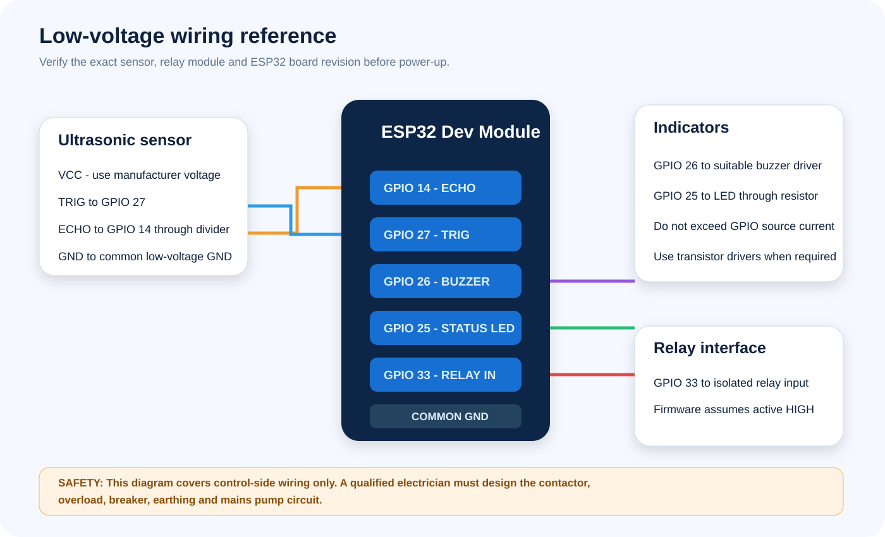

# Installation and wiring

## Confirmed firmware pins

| Function | ESP32 GPIO | Direction | Assumption |
|---|---:|---|---|
| Ultrasonic ECHO | 14 | Input | Must be limited to ESP32-safe voltage |
| Ultrasonic TRIG | 27 | Output | Sensor trigger |
| Buzzer | 26 | Output | Active high; driver may be required |
| Status LED | 25 | Output | Use a current-limiting resistor |
| Relay command | 33 | Output | Active high; verify relay module polarity |

These pins preserve the supplied legacy firmware contract. Pin correctness in
source code does not prove that the physical board was wired to those pins.

## Required electrical design

- Use an isolated relay module or a correctly designed transistor/opto-isolator
  interface. Do not drive a contactor coil directly from GPIO 33.
- If the ultrasonic sensor ECHO signal is 5 V, use a voltage divider or level
  shifter before GPIO 14. The ESP32 GPIO is not 5 V tolerant.
- Power the ESP32 and sensor from a regulated supply with sufficient current and
  brownout margin. Keep motor and contactor transients away from logic power.
- Connect low-voltage grounds only where required by the selected isolated or
  non-isolated interface design.
- Put the controller in a suitable enclosure with strain relief and protection
  against moisture, insects, dust and condensation.
- The pump circuit requires a correctly rated breaker, contactor, overload
  protection, earthing and cable. This work belongs to a qualified electrician.

## Multimeter checks before power-up

1. With power disconnected, confirm there is no short between the logic supply
   rail and ground.
2. Confirm continuity from each ESP32 pin to the intended module input only.
3. Confirm the relay contact terminals are isolated from the ESP32 control side.
4. Power only the low-voltage supply and measure the ESP32 rail before inserting
   or connecting the board.
5. Measure the ultrasonic ECHO high level. It must be within the ESP32 input
   limit before connecting GPIO 14.
6. Toggle the relay without a pump connected and verify whether HIGH actually
   energizes the module. If polarity differs, change the firmware constants and
   rebuild before continuing.

## Tank measurement setup

The sensor must point vertically at a reasonably flat water surface without
obstructions. Configure:

- **Usable depth:** distance from the full-water line to the usable bottom.
- **Mounting offset:** distance from the sensor face to the full-water line.
- **Lower threshold:** level at or below which automatic filling may start.
- **Upper threshold:** level at which filling stops.

The current defaults are 60% start, 95% stop and 10 cm mounting offset. Verify
depth with physical measurements rather than relying on the default.

## Controlled commissioning

1. Test sensing with the relay and pump disconnected.
2. Compare dashboard readings against several manual water-depth measurements.
3. Test relay output with a lamp or meter on the isolated control circuit.
4. Test automatic start and stop using a safe simulated tank level.
5. Disconnect the sensor and confirm the relay requests OFF.
6. Disconnect Wi-Fi and confirm local automatic control still operates.
7. Only then commission the contactor and pump under qualified supervision.
