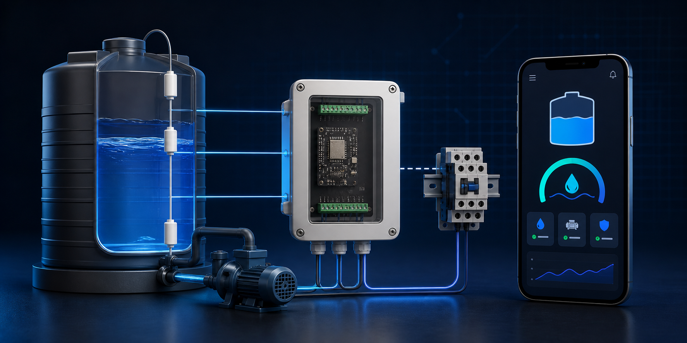
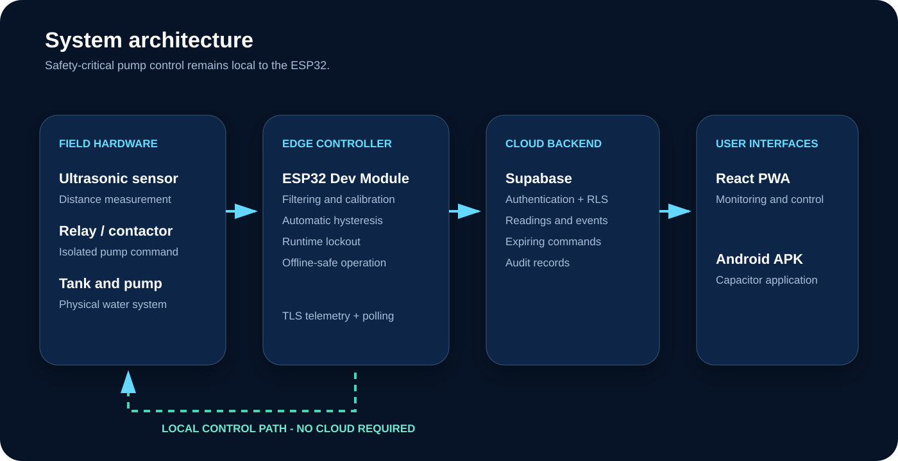
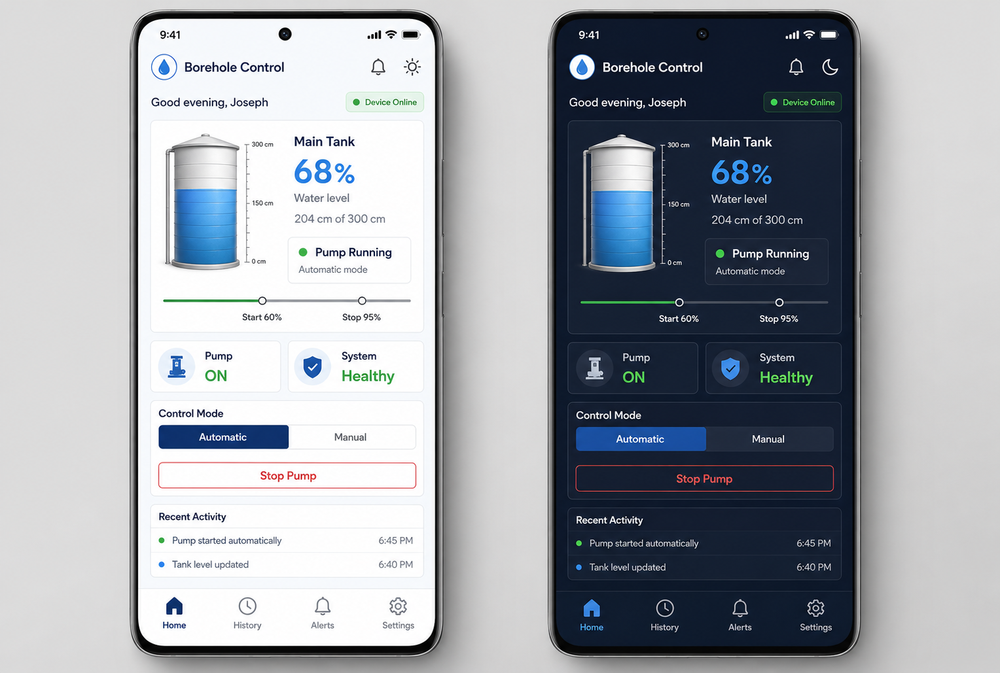

# IoT borehole control system

## Abstract

The Kahalla IoT Borehole Control System combines deterministic ESP32 pump
control with authenticated remote monitoring. An ultrasonic sensor estimates
tank level, while local hysteresis logic starts and stops a relay command between
configurable thresholds. A React dashboard and Android application present
telemetry, history, alerts and supervised commands through a Supabase backend.
The design deliberately keeps automatic stopping and sensor-failure handling on
the controller so cloud latency or internet loss does not become part of the
sample-critical control loop.

## Problem statement

Manual borehole operation can lead to overflow, unnecessary pump runtime and
poor visibility of tank status. A cloud-only solution would add another failure
mode: loss of connectivity could prevent timely control. The system therefore
needs local automation, remote visibility, safe command handling and a clear
boundary between low-voltage electronics and mains pump equipment.

## Objectives

1. Measure and display tank level from an ultrasonic distance sensor.
2. Start and stop filling locally using configurable hysteresis thresholds.
3. Default the pump command to OFF during boot, invalid sensing and lockout.
4. Provide secure user authentication and device-scoped authorization.
5. Record telemetry, events and expiring command results.
6. Provide responsive web and Android interfaces.
7. Preserve a practical client flashing and commissioning path.

## Architecture

The ESP32 samples the sensor every 500 ms and forms a median from five valid
samples. Three validated readings are required before automatic control is
enabled. Invalid, stale or repeatedly failed measurements request the safe OFF
state. The controller publishes telemetry every 10 seconds and polls for remote
commands every five seconds when Wi-Fi is available.

Supabase provides account authentication, row-level device authorization,
device-token verification, current state, historical readings, events and
short-lived commands. The PWA uses the publishable client key; privileged secret
keys are not embedded in the frontend.

## Control method

Automatic control uses hysteresis. When level falls to or below the lower
threshold, filling may begin. When level reaches the upper threshold, filling
stops and remains stopped until level later falls through the lower threshold.
This avoids rapid relay cycling around one threshold. Additional protections
include a minimum switch interval, maximum runtime lockout, sensor health checks
and stale-reading rejection.

## Interfaces

The mobile-first interface supports light and dark themes, authenticated login,
tank and pump status, recent activity, history, alerts, settings, guidance and
responsible-use notices. The same web application is packaged with Capacitor for
Android. The image above is a design reference; deployed behavior must be judged
from the live application and test results.

## Implementation status

| Area | Status | Evidence boundary |
|---|---|---|
| Firmware control tests | PASS | Native automated tests |
| PlatformIO firmware build | PASS | ESP32 binary generated |
| Arduino sketch build | PASS | ESP32 Arduino compile completed |
| Dashboard checks | PASS | Test, type check, lint and build |
| GitHub Pages | PASS | Production URL serves deployed assets |
| Android debug APK | PASS | Built and v1/v2 signature verified |
| Supabase schema security | PASS | RLS/policies deployed; advisor clear at verification time |
| Physical hardware | NOT VERIFIED | Requires real ESP32, sensor and relay tests |
| Pump installation | NOT VERIFIED | Requires qualified electrical commissioning |

## Limitations and future work

- Physical relay polarity and sensor ECHO voltage still require measurement.
- Ultrasonic performance depends on tank shape, condensation, turbulence and
  sensor positioning.
- The Android package is debug-signed; commercial distribution requires release
  signing and store preparation.
- Captive-portal provisioning should be reviewed for installation-site security.
- Production deployments should add monitoring, backup, token rotation and a
  documented device replacement process.

## Conclusion

The repository implements the intended software architecture and produces web,
Android and ESP32 artifacts. Compilation and cloud deployment provide useful
evidence, but they do not establish field safety or reliability. Completion of
the controlled commissioning checklist is required before claiming an operating
borehole installation.
